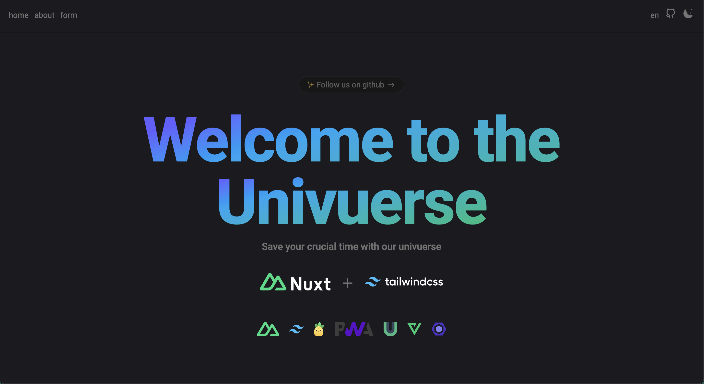

# Nuxt Starter Pack

> Save your crucial time with our collection of Nuxt + Tailwind CSS setup for your project

<p align="center">

</p>

<h2 align="center">
<a href="https://github.com/The-Univuerse/nuxt-tailwind-starter-pack">Nuxt Starter Pack</a> for Nuxt 3
</h2>
<br>

### Features

 [Nuxt v3](https://nuxt.com/) - SSR, ESR, File-based routing, components auto importing, modules, etc.

 [Vite](https://vite.dev/) - Next generation frontend tooling. It's fast!

 [Tailwindcss v4](https://unocss.dev/) - Customizable · Powerful · Fast · Joyful

 [@nuxt/icon](https://github.com/nuxt/icon) - 200,000+ ready to use icons from [iconify](https://icon-sets.iconify.design/)

 Typescript, Don't worry about that. Put your interface once [global](https://github.com/The-Univuerse/nuxt-tailwind-starter-pack/blob/main/index.d.ts#L2). And import to anywhere

 Pinia, The intuitive store for Vue.js. [(./stores/numberCounter.ts)](https://github.com/The-Univuerse/nuxt-tailwind-starter-pack/blob/main/stores/numberCounter.ts)

 [VueUse](https://vueuse.org/) - Collection of Essential Vue Composition Utilities

 [PWA](https://vite-pwa-org.netlify.app/) - Zero Config PWA, Offline Support Behavior

 [VeeValidate](https://vee-validate.logaretm.com/v4/) - Painless Vue forms, Let's me take your pain 💪

 Eslint - Press <code>CMD + S</code> let's eslint take your code to a Beauty Salon see this

 [Multi Language](https://github.com/The-Univuerse/nuxt-tailwind-starter-pack/tree/main/i18n/locales) - Ship your websites around the world and make sure they are know your achievements

### Plugins

- [@nuxtjs/color-mode](https://color-mode.nuxtjs.org/) - Dark and Light mode with auto detection made easy with Nuxt 🌗

- [@nuxtjs/i18n](https://i18n.nuxtjs.org/) - I18n (Internationalization) module for your Nuxt project powered by Vue I18n.

- [@pinia/nuxt](https://pinia.vuejs.org/ssr/nuxt.html) - Type Safe, Extensible, and Modular by design. Forget you are even using a store.

- [@vueuse/nuxt](https://vueuse.org/guide/#nuxt) - Collection of Essential Vue Composition Utilities

- [@nuxt/icon](https://github.com/nuxt/icon) - The <Icon> component, supporting Iconify, Emojis and custom components.

- [@vite-pwa/nuxt](https://github.com/vite-pwa/nuxt) - Zero-config PWA Plugin for Nuxt

### Coding Style

- Use composition API with typescript lang `<script lang="ts" setup>`
- Linter by [Eslint](https://eslint.org/) with [@antfu/eslint-config](https://github.com/antfu/eslint-config)

### Tools

- [VsCode Extensions](https://github.com/The-Univuerse/nuxt-tailwind-starter-pack/blob/main/.vscode/extensions.json)

  - [Eslint](https://marketplace.visualstudio.com/items?itemName=dbaeumer.vscode-eslint)
  - [i18n Ally](https://marketplace.visualstudio.com/items?itemName=lokalise.i18n-ally)
  - [Iconify IntelliSense](https://marketplace.visualstudio.com/items?itemName=antfu.iconify)
  - [Volar](https://marketplace.visualstudio.com/items?itemName=Vue.volar)

### Try it Now!

[Create Repo from this template on Github](https://github.com/The-Univuerse/nuxt-tailwind-starter-pack/generate)

##### Clone to Local

```bash
npx degit The-Univuerse/nuxt-tailwind-starter-pack nuxt-tailwind
cd nuxt-tailwind
```

#### Setup

Setup Environment

```bash
cp env_example .env
# change the environment based on your project

NUXT_BASE_URL=your_base_url
NUXT_SITE_NAME=your_site_name
```

Make sure to install dependencies:

```bash
# npm
npm install

# pnpm
pnpm install

# yarn
yarn install

# bun
bun install
```

#### Development Server

Start the development server on `http://localhost:3000`:

```bash
# npm
npm run dev

# pnpm
pnpm dev

# yarn
yarn dev

# bun
bun run dev
```

#### Production

Build the application for production:

```bash
# npm
npm run build

# pnpm
pnpm build

# yarn
yarn build

# bun
bun run build
```

Locally preview production build:

```bash
# npm
npm run preview

# pnpm
pnpm preview

# yarn
yarn preview

# bun
bun run preview
```

##### Nuxt Minimal Starter

Look at the [Nuxt documentation](https://nuxt.com/docs/getting-started/introduction) to learn more.

Check out the [deployment documentation](https://nuxt.com/docs/getting-started/deployment) for more information.
